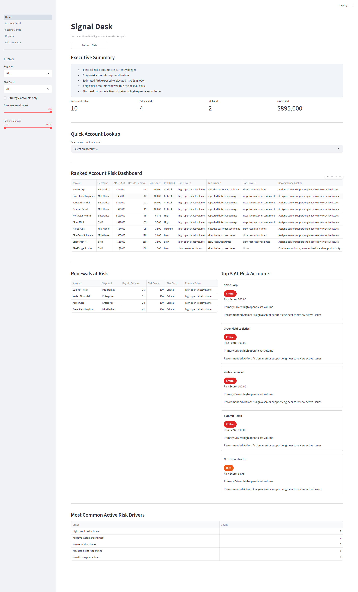
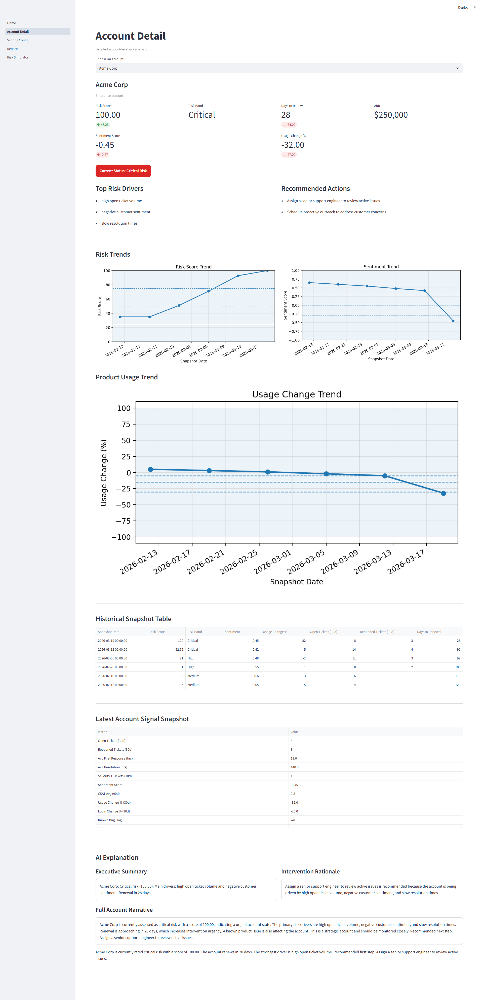
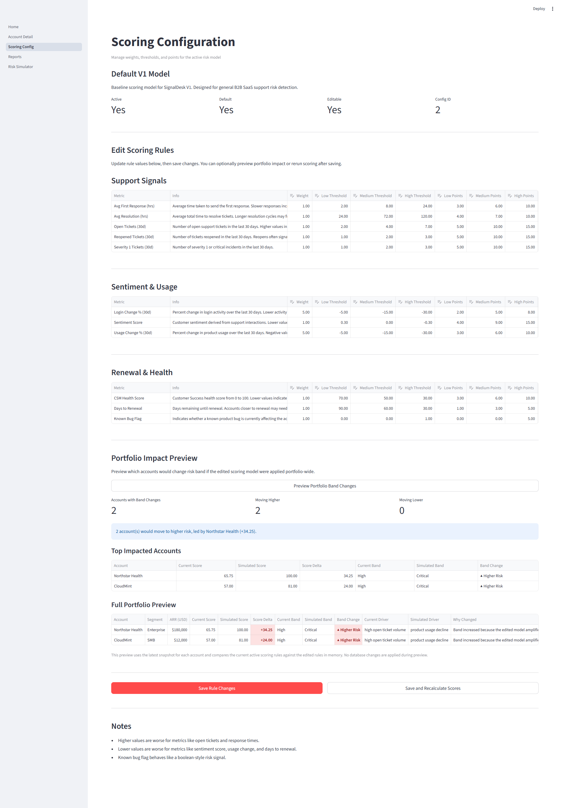
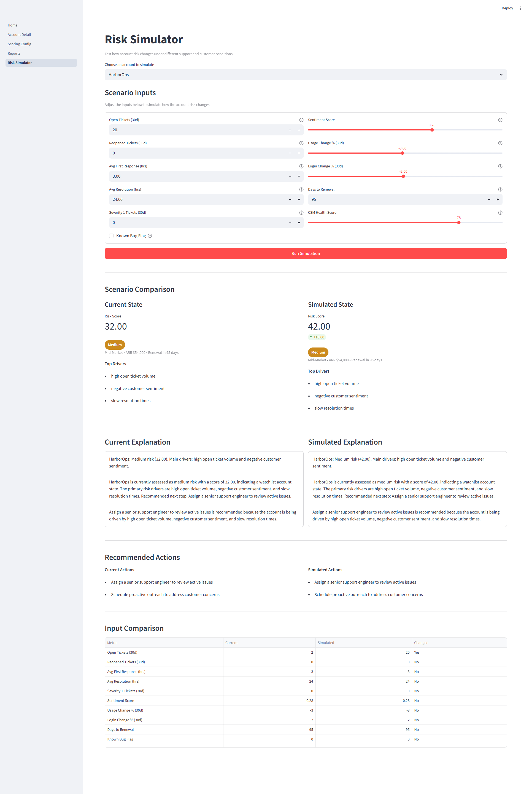
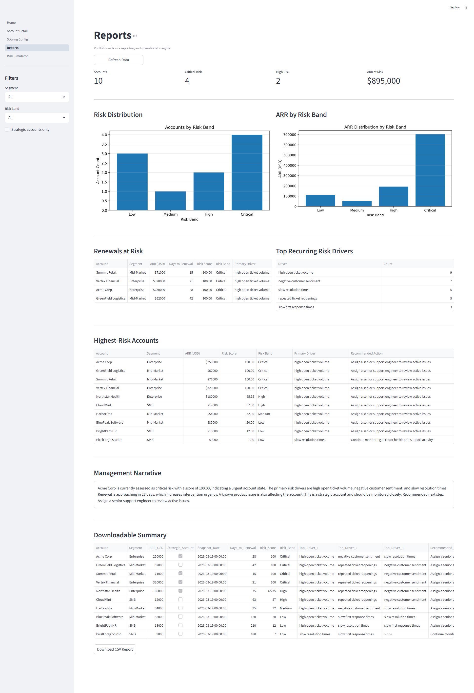

# 🚀 SignalDesk

Customer Risk Intelligence for Proactive Support

SignalDesk is an AI-driven customer risk intelligence platform designed to help Support and Customer Success teams identify escalation risk early, understand why accounts are at risk, and simulate how changes to scoring models impact the entire customer portfolio.

---

## 💡 Why SignalDesk?

In most organizations, customer risk is:

* reactive (after escalation happens)
* fragmented across tools (tickets, CSAT, usage, etc.)
* difficult to quantify or explain

SignalDesk solves this by:

* centralizing customer signals
* scoring risk dynamically
* providing explainability
* enabling what-if simulation of scoring models before rollout

---

## ✨ Key Features

### 📊 Customer Risk Dashboard

* Portfolio-level view of customer risk
* Executive summary of key risk drivers
* Top accounts at risk and renewal exposure

### 🔍 Account Intelligence

* Historical risk trendlines
* Signal-level breakdown (tickets, sentiment, engagement, etc.)
* AI-generated explanation of why an account is at risk

### ⚙️ Configurable Scoring Model

* Fully configurable scoring rules
* Adjustable weights and thresholds
* Friendly UI for non-technical users

### 🧪 Risk Simulator

* Modify account signals to simulate real-world scenarios
* Instantly see score and risk band changes
* Compare before vs after outcomes

### 📈 Portfolio Impact Preview (🔥 standout feature)

* See how scoring changes affect ALL accounts
* Identify accounts moving to higher/lower risk
* View score deltas and band changes
* Understand *why* changes happen

---
### 🧠 How Risk Scoring Works

SignalDesk uses a configurable scoring engine to evaluate customer risk based on multiple signals across support, engagement, and product usage.
*Each account is scored using a weighted combination of metrics such as:
*Ticket volume and reopen rates
*SLA breaches and resolution times
*Customer sentiment and CSAT
*Engagement recency and product usage trends

Each metric has:
*A defined direction (higher is better or worse)
*Configurable thresholds
*A weight that determines its impact on the final score

The system then:
*Normalizes individual signals into comparable risk contributions
*Aggregates weighted contributions into a total risk score
*Maps the score into a risk band (Low, Medium, High)
*Identifies the primary risk driver for explainability

This approach enables:
*Transparent and explainable scoring
*Easy tuning of the model via configuration
*Scenario simulation and portfolio-wide impact analysis

The scoring model is intentionally modular to support future integration with machine learning–based signal weighting and anomaly detection.

---

## 🏗️ Tech Stack

* Python
* Streamlit (UI)
* PostgreSQL (data storage)
* Pandas (data processing)
* Matplotlib (visualizations)

---

## 📂 Project Structure

```text
signaldesk/
├── app/                 # Streamlit UI
│   ├── Home.py
│   └── pages/
├── engine/              # Scoring + AI logic
├── db/                  # Database connection + queries
├── sql/                 # Schema + seed data
├── logs/                # Runtime logs
├── run_signaldesk.bat   # One-click launcher
├── requirements.txt
├── .env.example
├── .gitignore
```

---

## ⚡ How to Run Locally

### 1. Clone the repository

```bash
git clone <your-repo-url>
cd signaldesk
```

---

### 2. Install dependencies

```bash
pip install -r requirements.txt
```

---

### 3. Setup PostgreSQL database

Create a database (example: `signaldesk`), then run:

```bash
psql -U postgres -d signaldesk -f sql/schema.sql
psql -U postgres -d signaldesk -f sql/seed_defaults.sql
psql -U postgres -d signaldesk -f sql/seed_demo_data.sql
psql -U postgres -d signaldesk -f sql/seed_historical_snapshots.sql
```

---

### 4. Configure environment variables

Create a `.env` file based on `.env.example`:

```env
DB_HOST=localhost
DB_PORT=5432
DB_NAME=signaldesk
DB_USER=postgres
DB_PASSWORD=your_password
```

---

### 5. Run the application

👉 Simply double-click:

```text
run_signaldesk.bat
```

This will:

* run the scoring engine
* start the Streamlit app
* open the app in your browser

⚠️ Do not close the command window while using the app.

---

## 📸 Screenshots


## 📸 Screenshots

### 🏠 Home Dashboard  
Portfolio-level view of customer risk, key drivers, and top accounts requiring attention.



---

### 🔍 Account Detail  
Deep dive into a single account with historical trends, signal breakdown, and AI-generated risk explanation.



---

### ⚙️ Scoring Configuration  
Customize scoring rules and preview portfolio-wide impact.



---

### 🧪 Risk Simulator  
Simulate real-world scenarios and see score and band changes instantly.



---

### 📊 Reports & Insights  
Analyze portfolio-wide trends and risk distribution.



---

## 🧠 What Makes This Interesting

This project goes beyond dashboards by combining:

* Predictive scoring (risk modeling)
* Explainability (why an account is at risk)
* Simulation (what happens if we change the model)
* Portfolio-level impact analysis

This mirrors real-world challenges in:

* Customer Success platforms
* Support analytics tools
* AI-driven operations

---

## 🎯 Use Cases

* Identify accounts likely to escalate before they do
* Prioritize high-risk renewals
* Optimize support and success interventions
* Test scoring model changes safely before rollout

---

## 🚀 Future Improvements

* Real-time data ingestion (APIs instead of seeded data)
* LLM-based deeper explanations (OpenAI integration)
* Role-based access control
* Scheduled scoring jobs (cron / background workers)
* Deployment (Docker / cloud hosting)

---

## 👤 Author

Built by someone with deep experience in:

* Technical Support
* Customer Success
* Enterprise SaaS systems

Focused on bridging:
👉 Support operations + AI-driven decision making

---

## ⭐ Final Note

This project is intended to demonstrate how AI can be applied to proactive customer support — not just reacting to issues, but predicting and preventing them.

---
